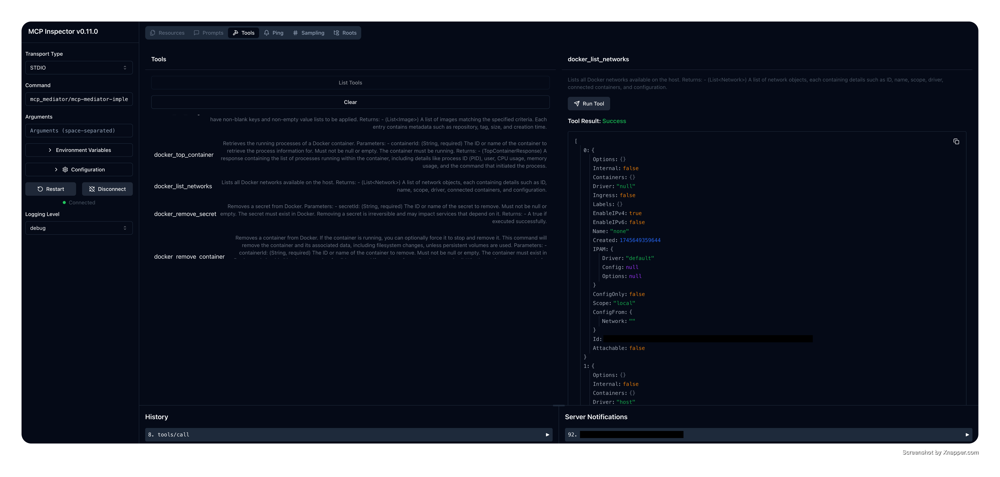

# MCP Mediator Docker Implementation

This module provides a Docker-based implementation of an MCP (Message Communication Protocol) server using the [`mcp_mediator`](https://github.com/makbn/mcp_mediator) core framework.

It acts as a pluggable server that leverages Docker's API to handle MCP messages using mediator-driven handler registration and execution.



### Usage Examples

```shell
java -jar docker-mcp-server.jar \
  --docker-host=tcp://localhost:2376 \
  --tls-verify \
  --cert-path=/etc/docker/certs \
  --server-name=my-server \
  --server-version=1.0.0 \
  --max-connections=150 \
  --docker-config=/custom/docker/config
```


To run Docker MCP Server with Claude Desktop with `java -jar`:
```yaml
{
  "mcpServers": {
    "my_java_mcp_server": {
      "command": "java",
      "args": [
        "-jar",
        "docker-mcp-server.jar"
        "--docker-host=tcp://localhost:2376",
        "--tls-verify", # not required
        "--cert-path=/etc/docker/certs", # required only if --tls-verify is available
        "--server-name=my-docker-mcp-server",
        "--server-version=1.0.0",
        "--max-connections=150",
        "--docker-config=/custom/docker/config"
      ]
    }
  }
}
```

Or create the native image (see the steps below) and use the standalone application:
```yaml
{
  "mcpServers": {
    "my_java_mcp_server": {
      "command": "docker-mcp-server-executable",
      "args": [
        "--docker-host=tcp://localhost:2376" // rest of args 
      ]
    }
  }
}
```

### How to Build
To build the executable:
```bash
mvn clean compile package
```
This command creates a jar file under `target` folder `mcp-mediator-implementation-docker-[version].jar`. You can stop here and use the jar file and execute it
using `java -jar` command. Or, you can create a standalone executable application using GraalVM native image:

```bash
 native-image -jar mcp-mediator-implementation-docker-[version].jar     
```
and this command creates an executable file: `'mcp-mediator-implementation-docker-[version]` that can be executed.

### Supported CLI Options

| Option             | Description                                           | Default                       |
|--------------------|-------------------------------------------------------|-------------------------------|
| `--docker-host`    | Docker daemon host URI                                | `unix:///var/run/docker.sock` |
| `--tls-verify`     | Enable TLS verification (used with `--cert-path`)     | `false`                        |
| `--cert-path`      | Path to Docker TLS client certificates (required if TLS is enabled) | _none_              |
| `--docker-config`  | Custom Docker config directory                         | `~/.docker`                    |
| `--server-name`    | Server name for the MCP server                         | `docker_mcp_server`            |
| `--server-version` | Server version label                                   | `1.0.0.0`                      |
| `--max-connections`| Maximum number of connections to Docker daemon        | `100`                          |
| `--log-level`      | Logging level (`TRACE`, `DEBUG`, `INFO`, etc.)        | `DEBUG`                        |
| `--log-file`       | Path to log output file                                | `logs/example.log`             |
| `--help`           | Show usage and available options                       | _n/a_                          |


### Supported Docker Commands as MCP Server Tools

| MCP Tool Name                                | Description                                    |
| -------------------------------------------- | ---------------------------------------------- |
| docker\_start\_container                     | Start a Docker container by ID.                |
| docker\_stop\_container                      | Stop a Docker container by ID.                 |
| docker\_leave\_swarm                         | Remove a node from Docker Swarm.               |
| docker\_container\_diff                      | Show changes made to a container’s filesystem. |
| docker\_build\_image\_file                   | Build an image from Dockerfile or directory.   |
| docker\_inspect\_volume                      | Get details of a Docker volume.                |
| docker\_remove\_service                      | Remove a Docker service by ID.                 |
| docker\_list\_containers                     | List containers with optional filters.         |
| docker\_inspect\_swarm                       | Inspect Docker Swarm details.                  |
| docker\_push\_image                          | Push image to registry, supports auth.         |
| docker\_copy\_archive\_to\_container         | Copy a tar archive into a running container.   |
| docker\_stats\_container                     | Fetch container stats (CPU, memory, etc.).     |
| docker\_disconnect\_container\_from\_network | Disconnect container from Docker network.      |
| docker\_remove\_container                    | Remove a container, with optional force.       |
| docker\_inspect\_service                     | Inspect a Docker service.                      |
| docker\_remove\_secret                       | Remove a Docker secret by ID.                  |
| docker\_pull\_image                          | Pull image from registry, supports auth.       |
| docker\_inspect\_container                   | Inspect container config and state.            |
| docker\_unpause\_container                   | Unpause a paused container.                    |
| docker\_list\_images                         | List Docker images with optional filters.      |
| docker\_list\_services                       | List all Docker services in the swarm.         |
| docker\_remove\_image                        | Remove an image, with force and prune options. |
| docker\_create\_network                      | Create a Docker network.                       |
| docker\_tag\_image                           | Tag an image with a new repo and tag.          |
| docker\_authenticate                         | Authenticate to Docker registry.               |
| docker\_exec\_command                        | Execute a command inside a container.          |
| docker\_remove\_swarm\_node                  | Remove a swarm node, optionally forcibly.      |
| docker\_search\_images                       | Search Docker Hub for images.                  |
| docker\_list\_networks                       | List all Docker networks.                      |
| docker\_remove\_volume                       | Remove a Docker volume.                        |
| docker\_create\_container                    | Create a container with custom settings.       |
| docker\_remove\_network                      | Remove a Docker network.                       |
| docker\_copy\_archive\_from\_container       | Copy files from a container to the host.       |
| docker\_rename\_container                    | Rename a Docker container.                     |
| docker\_pause\_container                     | Pause a running container.                     |
| docker\_version                              | Get Docker version information.                |
| docker\_list\_swarm\_nodes                   | List all nodes in the Docker swarm.            |
| docker\_log\_container                       | Retrieve logs from a container.                |
| docker\_prune                                | Prune unused Docker resources.                 |
| docker\_inspect\_network                     | Get detailed info about a network.             |
| docker\_kill\_container                      | Send a kill signal to a container.             |
| docker\_top\_container                       | Get running processes in a container.          |
| docker\_list\_volumes                        | List Docker volumes with optional filters.     |
| docker\_update\_swarm\_node                  | Update the config of a swarm node.             |
| docker\_info                                 | Show Docker system-wide info.                  |
| docker\_log\_service                         | Get logs from a Docker service.                |

Work in progress, more to be added.


### DockerClientService Function Coverage
 Check the [DockerClientService](./src/main/java/io/github/makbn/mcp/mediator/docker/internal/DockerClientService.java) class for the full list of available and planned tools (to be implemented)

> [!IMPORTANT]  
> Almost all the MCP Tools' descriptions and names are generated automatically using AI agent! 


### 🧩 Repository Structure and Git Subtree Setup

This project is a **Git subtree module** of the parent repository [`makbn/mcp_mediator`](https://github.com/makbn/mcp_mediator). It is kept in its own repository to support independent versioning, CI, and release processes, while remaining integrated into the main `mcp_mediator` mono-repo.

### 🔀 Cloning Structure

If you're working in the context of the full `mcp_mediator` system:

```bash
git clone https://github.com/makbn/mcp_mediator.git
cd mcp_mediator


